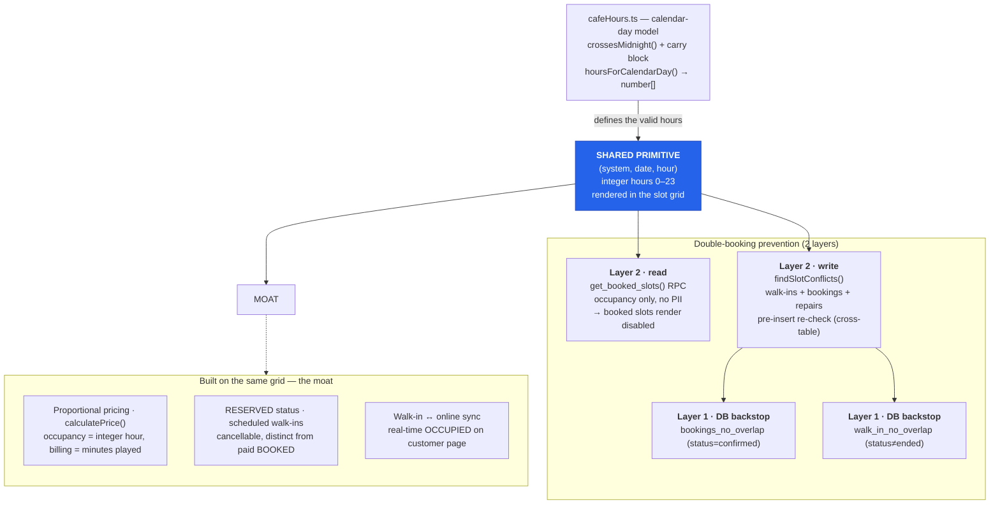

# CLAUDE.md

This file provides guidance to Claude Code (claude.ai/code) when working with code in this repository.

## Project

Gaming Cafe Booking Website ("GameSpot") — a Vite + React + TypeScript SPA where customers browse gaming cafes, book gaming systems by the hour, and cafe owners manage their cafe (systems, live walk-in sessions, bookings, repairs) from a dashboard. Backend is Supabase (Postgres + Auth). Originally scaffolded from a Figma Make export.

## Commands

- `npm i` — install dependencies
- `npm run dev` — start the Vite dev server
- `npm run build` — production build (`vite build`)

There is no lint or test script configured in `package.json` — don't assume `npm test`/`npm run lint` exist.

## Environment

Supabase credentials are required at runtime via Vite env vars, read in `src/supabase.ts`:
- `VITE_SUPABASE_URL`
- `VITE_SUPABASE_ANON_KEY`

There is no `.env.example` in the repo — check with the user for local credentials if `npm run dev` fails to reach Supabase.

## Architecture

### Entry / routing

- `src/main.tsx` mounts the app, wrapping the router in `AuthProvider` (`src/app/context/AuthContext.tsx`), which owns Supabase auth session state and the current user's `profiles` row (`user`, `profile`, `signOut()` via `useAuth()`).
- `src/app/routes.tsx` defines all routes with `react-router`'s `createBrowserRouter`. `Root.tsx` (`src/app/components/Root.tsx`) is the layout shell (header/nav/`Outlet`) shown on `/`, `/games`, `/hardware`, and cafe detail pages.
- `Root.tsx` also hardcodes an `ADMIN_EMAILS` allowlist that gates the `/admin` (`AdminApprovals`) link/route — there's no `role: "admin"` in the DB, admin-ness is purely this email list.
- `vercel.json` rewrites all non-`/api` paths to `index.html` (SPA hosting on Vercel), and `api/*.ts` are Vercel serverless/edge functions (e.g. `api/steam-search.ts` proxies the Steam store search API to dodge CORS; `api/ping.ts` is a health check).

### Data model: Supabase-backed (mock path removed 2026-07-29)

The codebase used to have two parallel implementations of cafe browsing/booking — a static mock path and a Supabase-backed path. **The mock path was removed 2026-07-29** (commit `a263e907`, "Delete demo-only mock pages"): `CafeCard.tsx`, `CafeDetails.tsx`, `FilterByHardware.tsx`, `GamingSystemSelector.tsx`, `ReviewsSection.tsx`, `SearchByGame.tsx` were deleted, along with the `/games`, `/hardware`, and `/cafe/:id` routes and the tab nav strip in `Root.tsx` that linked to them. A catch-all `NotFound.tsx` route was added.

- **Current (only) path**: `BrowseCafes` (the homepage) and `Db*`-prefixed components (`DbCafeDetails`, `DbReviewsSection`) plus the owner-dashboard components (`Dashboard`, `CafeEditor`, `SystemsManager`, `LiveSessions`, `RepairSlotsManager`, `RevenueStats`, `RegisterCafe`, `AdminApprovals`) all query Supabase tables directly with `supabase.from(...)`. Cafe detail lives at `/cafe/db/:id` → `DbCafeDetails`.
- `mockData.ts` was deleted entirely in Stage 2 (commit `60e3ebdd`). Shared types (`GamingSystem`) now live in `src/app/types.ts`; `src/app/data/gameImages.ts` exports `fetchGameImage()` which queries the Steam search proxy for real cover art (replaced the static Unsplash map 2026-08-24, commit `ecedfeab`). `SteamGameImage.tsx` wraps it as a React component with loading/error states.
- `AdvancedBookingInterface` is fed a converted list of systems (using the `GamingSystem` shape from `src/app/types.ts`) and always queries `bookings`/`repair_slots`/`walk_in_sessions` live from Supabase to compute slot availability.

### Supabase schema (inferred — no migrations/SQL in repo)

There are no `.sql` files or a `supabase/` migrations directory checked in; the schema only exists as inferred from `supabase.from(...)` calls scattered across components. Known tables and key columns (grep for `.from("<table>")` to find all usages before changing shape):

- `profiles` — `id` (= auth user id), `email`, `full_name`, `role` (`"owner"` gates `/dashboard`; anything else is a regular customer)
- `cafes` — `owner_id`, `name`, `description`, `city`, `address`, `phone`, `email`, `price_per_hour`, `image_url`, `is_approved`, `amenities` (array), `games` (array), `gallery_images` (text[], default `{}`, up to 10 image URLs — added 2026-08-24), `latitude`, `longitude` (nullable doubles; geocoded from the address on register/edit), `location` (PostGIS `geography(Point,4326)`, **generated always** from lng/lat — never write it directly, only write lat/lng). Nearby search goes through the `nearby_cafes(p_lat, p_lng, p_radius_m, p_limit)` RPC (see Section 13), NOT a direct distance query. `price_per_hour` is now the **cafe DEFAULT / fallback** — the effective price is per-system (`gaming_systems.price_per_hour` overrides it; NULL there inherits this). See per-system pricing below.
- `cafe_hours` — `cafe_id`, `day_of_week` (0-6), `open_time`/`close_time` (`"HH:MM"` strings) — the hours source of truth (see the midnight-crossing fix entry in Section 4). Replaces the legacy `cafes.opening_time`/`closing_time` columns, dropped 2026-08-01.
- `gaming_systems` — `cafe_id`, `name`, `type` (`"PC" | "Console"`), `gpu`, `cpu`, `ram`, `console`, `price_per_hour` (nullable numeric, `>= 0`; **NULL = inherit the cafe's `price_per_hour` default**). Per-system pricing added 2026-08-21. All price math goes through `effectiveSystemPrice(systemPrice, cafeDefault)` / `minSystemPrice(...)` in `src/app/utils/pricing.ts` — never read `price_per_hour` raw for a total, or NULL systems price at 0.
- `bookings` — `id`, `user_id` (NOT NULL), `cafe_id`, `system_id`, `booking_date`, `start_time`/`end_time` (`"HH:MM"`), `num_people`, `total_price`, `status` (`"confirmed"` is the only status filtered on), `players` (JSON array of `{name, phone}`), `cancellation_reason` (nullable)
- `walk_in_sessions` — `id`, `cafe_id`, `system_id`, `session_date`, `slots` (int[] of hours), `start_time`/`end_time` (**integer hour**, not a string — different convention from `bookings`), `status` (`"scheduled" | "active" | "ended"`), `started_at`/`ended_at`, `customer_name`/`customer_phone`/`note` (nullable, for owner-created reservations)
- `repair_slots` — `cafe_id`, `system_id`, `repair_date`, `start_hour`/`end_hour` (int), `reason`

Note the two different time representations in play: `bookings` uses `"HH:MM"` strings, while `walk_in_sessions`/`repair_slots` use integer hours. Slot-availability code (`AdvancedBookingInterface`) has to normalize between them — watch for this when editing availability logic.

### Walk-in sessions vs online bookings

Cafe owners can start ad-hoc "walk-in" sessions for a system from the dashboard (`LiveSessions.tsx`) in addition to customers' pre-booked online reservations (`bookings` table). A walk-in session is `"scheduled"` (reserved, not yet started) or `"active"` (customer physically playing, timer running) before being marked `"ended"`. `LiveSessions` polls a `setInterval` clock (`now` state, ticks every second) to auto-end sessions past their `end_time` and to compute a live progress bar and pro-rated price (`calculatePrice`, based on elapsed minutes within the current hour, not a flat per-hour charge). When starting/extending a walk-in session, availability must be cross-checked against `bookings` for the same system/hour to avoid double-booking a slot that's already reserved online.

### UI components

`src/app/components/ui/` is a shadcn/ui-style primitives library (Radix UI + Tailwind, `class-variance-authority` for variants) — treat these as generated/vendored building blocks, not app logic. (The Figma-Make `figma/ImageWithFallback.tsx` component was deleted 2026-08-24, commit `4f8ebeae` — it had zero imports; the `figma:asset` resolver plugin in `vite.config.ts` is unrelated and stays.) Styling is Tailwind v4 (`@tailwindcss/vite` plugin, config-less — tokens live in `src/styles/theme.css`/`globals.css`).

## Notes from the Figma Make scaffold

- `vite.config.ts` includes a custom `figma-asset-resolver` plugin resolving `figma:asset/...` imports to `src/assets/`, and the React + Tailwind Vite plugins are required by the Make tooling even where Tailwind classes aren't the primary styling mechanism — don't remove them.
- Do not add `.css`, `.tsx`, or `.ts` to `assetsInclude` in `vite.config.ts`.
# GameOrbit / GameSpot — Project Brain
*Paste this entire file at the start of any new chat so the AI has full context immediately.*
*Last updated: 2026-08-24*

---

## 1. THE REAL VISION (don't lose this)

This is **not** "a gaming cafe booking website." The current build (GameSpot, this repo) is the **MVP prototype** for a much bigger company called **GameOrbit**.

Our core goal is NOT helping users discover gaming cafés — it's to become the **booking infrastructure** for gaming cafés.

Think of it like:
- Airbnb → for stays
- BookMyShow → for movies
- **GameOrbit → for gaming cafés**

We are not a directory/discovery site (that's the trap — don't build "Yelp for cafes"). We are building **precision booking at the PC/system level** — book the exact machine, with exact specs, exact games installed, in real time. Like booking a specific theatre seat, but for a gaming PC.

### Founder
Sri Sai Kumar Ojjela, 17, India. Currently studying for JEE; will go full-time on this after ~6 months. Plans to eventually find a technical co-founder. This MVP is being built solo via AI-assisted ("vibe") coding to validate the idea first.

### Market strategy (do not deviate from this sequencing)
- **Phase 1 — India**: validate product, build café network, prove demand. India has <1,000 dedicated gaming cafés — this is the testing ground, not the end goal.
- **Phase 2 — South Korea**: ~18,000-20,000 PC bangs, $7B+ market. High-performance culture, proves product quality.
- **Phase 3 — China**: 100,000-185,000+ cafés, $20B+ ecosystem. The real scale target.
- Roughly a 3-year horizon to shift focus toward Korea/China.

### Business model (future, not urgent now)
- Booking commissions
- SaaS subscription for café owners
- Premium listings / promotions
- Marketing campaign feature for café owners (Phase 2+): owners can send emails/SMS to customers who have visited their store

### Why this wins (the moat)
1. **Precision over approximation** — others help you find a café, we let you book the exact machine.
2. **Two-sided lock-in** — gamers depend on us for experience, cafés depend on us for operations (live PC tracking, walk-in sync, analytics, dynamic pricing).
3. **Data advantage** — over time we learn demand patterns, preferred setups, peak times → better pricing/recommendations.
4. **High switching cost** — once a café integrates and has booking history/data with us, leaving is costly.
5. **Walk-in + online sync** — no competitor tracks walk-ins in real time alongside online bookings. This is a unique moat.
6. **Proportional walk-in pricing** — no competitor does this. We charge walk-in customers only for the time they actually play, not rounded up to a full hour. This builds trust.

---

## 2. HARD PRODUCT RULES (from café owner validation — never compromise on these)

1. **Zero tolerance for double-booking.** Two people must never be able to book the same system at the same time.
2. ~~**Buffer time between sessions.**~~ **CANCELLED (2026-08-11) — see Rule 8.** Operational problem, not a software problem. Investigation findings preserved in chat history.
3. **Booking conflicts must be visually impossible to create** — booked slots show as unavailable in real time.
4. **Group booking constraint algorithm** (implemented in AdvancedBookingInterface.tsx):
   - Party size X, each wanting Y hours → must select exactly X × Y total slots
   - At most X systems can share the same time slot simultaneously
   - At most Y slots on any single system
5. **Owners need full visibility into bookings**: name, phone, system, time — so they can call the customer if needed.
6. **Owners need manual control over system availability** — mark under repair, start walk-in sessions, end sessions.
7. **All time slots are 1-hour boundaries. No exceptions.** Whether online booking or walk-in, the system always works in full hour slots. A walk-in starting at 9:18 AM on the 9:00 AM slot plays until 10:00 AM (end of slot), not until 10:18 AM.
8. ~~**Smart Transition Buffer ("Slot Compression")**~~ **OBSOLETE — CANCELLED (2026-08-11).**
   After full investigation (booking creation flow, slot availability logic, schema, edge cases),
   concluded the buffer solves a narrow edge case (last-second bookings leaving zero staff prep
   time) with disproportionate complexity. On fully-packed days the buffer doesn't create actual
   cleanup gaps — staff turnover happens regardless, same as restaurants clearing tables between
   customers. Physical turnover is an operational problem, not a software problem. Investigation
   findings (6-section report covering schema, flow, edge cases, schema impact) preserved in chat
   history for reference if ever revisited. The design spec below is kept for reference only.
   *(Original design: buffer carved AFTER session, activates only when next slot is pre-booked,
   10–25 min flexible duration tied to session length, owner-configurable via dashboard timer.)*
9. **Walk-in cutoff rule:** If current time is within 20 minutes of a slot's end AND the next slot is already booked online — owner CANNOT start a walk-in on that slot. Hard block with clear error message. If next slot is free, show a soft warning only (owner can proceed).
10. **Walk-in consecutive slots only:** Owner can only select consecutive time slots for a walk-in. Non-consecutive selection shows warning: "Please select only consecutive slots."
11. **Proportional walk-in pricing:** Walk-in customers are charged only for the time they actually play within their slots. Formula: minutes_played = (end_of_slot_in_minutes) - (actual_start_minute). Price = (minutes_played / 60) × hourly_rate. First slot is proportional, subsequent slots are full price.

---

## 3. MVP FEATURE SCOPE

- ✅ Customer auth & login
- ✅ Café owner registration → admin approval → public listing
- ✅ Owner dashboard (details, gaming systems, bookings, revenue tabs)
- ✅ Solo vs Group booking flow with slot-selection algorithm
- ✅ Booking confirmation with player details (name + phone per player)
- ✅ Booked slots reflected as unavailable in real time (double-booking prevention)
- ✅ Login required before booking (all 3 entry points protected)
- ✅ Contextual inline error messages for slot conflicts
- ✅ Owner sees full booking details: system name, player name, phone, time
- ✅ Repair slots — owner marks specific system+time as under repair
- ✅ Walk-in sessions — owner starts walk-in, timer runs, OCCUPIED shows on customer page
- ✅ Walk-in conflict popup — 3-option resolution (move, cancel+refund, call+reschedule)
- ✅ Walk-in proportional pricing — price breakdown shown before start, amount shown at end
- ✅ Walk-in 20-minute cutoff restriction — hard block when <20 min left and next slot booked
- ✅ "Live Now" tab — active/upcoming walk-ins AND online bookings, with timer controls
- ✅ Walk-in RESERVED status — scheduled walk-ins show amber RESERVED on customer page
- ✅ Slot grid respects café opening hours (reads from `cafe_hours`, the per-day schedule table — see the midnight-crossing fix entry in Section 4)
- ✅ DB-level double-booking prevention (`bookings_no_overlap` exclusion constraint)
- ✅ 7-day date picker for future bookings — owner sees future bookings in Gaming Systems tab (formerly Advanced Booking, absorbed 2026-07-27)
- ✅ Dashboard redesign — Gaming Systems tab shows full day slot grid per system (shipped 2026-07-27, see Section 8)
- ✅ Owner cancel booking + refund note (2026-07-23)
- ✅ My Bookings page for customers (/my-bookings) (2026-07-24)
- ✅ Edit/delete own review (customer) (2026-07-25)
- ✅ Review section overhaul — verified-booker gate, 5 category sub-ratings, threaded replies, "Cafe Owner" reply badge (2026-07-26, see Section 10)
- ✅ Photos in reviews via URL (up to 5 per review) — shipped 2026-08-24 (`6abbcca6`); file upload via Supabase Storage still deferred
- ✅ RevenueStats — excludes cancelled from revenue totals; fixed UTC upcoming-count bug; shows cancelled in recent list (2026-07-24)
- ✅ Per-system pricing — each system sets its own hourly rate (**required** when adding a system); shown as a `₹low–₹high` range where systems differ (2026-08-21, see Section 4)
- ✅ Cafe gallery images via URL (up to 10) — shipped 2026-08-24 (`6abbcca6`); displayed as grid on cafe detail page
- 🔲 Image upload for cafe cover/gallery (currently URL paste only — needs Supabase Storage)
- ~~🔲 Buffer system implementation (Smart Transition Buffer)~~ **CANCELLED (2026-08-11) — see Rule 8**
- ✅ Filter in booking interface (PC/Console + Has-Free-Slots) — shipped 2026-08-18 (`fb196633`); GPU filter still Phase 2
- ✅ Homepage filters (system type PC/Console + price range chips) — shipped 2026-08-18 (`fb196633`)
- ✅ Filter in Gaming Systems tab (owner dashboard: Free Now / In Use / Free at X time + PC/Console type) — shipped 2026-08-24 (`b0fa33d4`)
- ✅ Hardware autocomplete + case-insensitive hardware filter — shipped 2026-08-24 (`5b834624`, `ae48f54e`); homepage GPU/console filter + brand-grouped `HardwareCombobox` on the Add-System form (see Section 14)
- ✅ Airbnb-style location search — shipped 2026-08-26 (`e51cf469`, `edc077e7`); geocode-based combobox replaces text-match search + city dropdown; progressive word-drop fallback for Nominatim misses (see Section 13)
- 🔲 Custom SMTP (Resend/SendGrid) before real users
- ✅ Mobile responsiveness — homepage + customer booking flow made responsive 2026-08-18 (`873ea087`); owner dashboard not yet audited
- 🔲 Customer data collection (name, phone, email, city) for analytics — Phase 2
- 🔲 Marketing campaign feature for café owners — Phase 2

---

## 4. CURRENT TECHNICAL STATE (as of 2026-07-26)

**Stack:** React + TypeScript + Vite + Tailwind + shadcn/ui + React Router + Supabase
**Live:** gaming-cafe-website.vercel.app
**GitHub:** github.com/sai14april2009/gaming-cafe-website
**Local dev:** D:\PROJECT - PROTOTYPE OF ADVANCED INTERNET CAFE BOOKING\

**Supabase project ID:** zvgfmjzrnzallkwgrgqb
**Admin emails (hardcoded):** srisaikumar.ojjela@gmail.com, sai14april2009@gmail.com, alekhya.ojjela@gmail.com

### Seed data (added 2026-08-24)

5 fake cafes registered via the normal owner flow and admin-approved, all in Pune.
Everything is fake except the cafe address/area names. All owner passwords: `123456`.

| # | Cafe | Owner account | Area | Systems | Price range | Hours |
|---|------|---------------|------|---------|-------------|-------|
| 1 | Nexus LAN Arena | cafe1@gmail.com | Baner | 11 (8 PC + 3 Console) | ₹80–150 | 10:00–23:00 |
| 2 | Frag Point Arena | cafe2@gmail.com | Kothrud | 12 (8 PC + 4 Console) | ₹70–140 | 11:00–23:00 |
| 3 | Respawn Gaming Lounge | cafe3@gmail.com | Hinjewadi | 11 (8 PC + 3 Console) | ₹90–170 | 10:00–01:00 |
| 4 | Pixel Bunker | cafe4@gmail.com | Viman Nagar | 10 (7 PC + 3 Console) | ₹60–120 | 11:00–00:00 |
| 5 | Hexa Esports Hub | cafe5@gmail.com | Wakad | 11 (8 PC + 3 Console) | ₹80–150 | 09:00–02:00 |

55 total gaming systems with varied specs (RTX 3060–4090, PS5/Xbox/Switch consoles).
Cover images are Unsplash URLs (free, no auth). Phones are placeholder `+91 90000 0000X`.
All geocoded and pinned on the map via LocationPicker.

**Security (as of 2026-07-23):** Availability is now **secure by default**. Customer data
(names/phones in `bookings.players`) is **no longer exposed** — the `bookings` table is locked
down with RLS so the anon key can't read it. Availability queries go through the
`get_booked_slots()` RPC (occupancy only), **not** direct table reads. Full detail in the
"Security hardening" subsection of Section 4. When adding a new surface that needs slot
availability, call the RPC — do NOT `select` from `bookings` as anon/unauthenticated, it will
return 0 rows.

### DB tables (RLS enabled on all)
- `profiles`
- `cafes`
- `cafe_hours` — columns: `id, cafe_id, day_of_week (0-6), open_time, close_time`. Added 2026-07-29 in the midnight-crossing fix (migration `cafe_hours_schema_and_migration`); is now the sole hours source — the legacy `cafes.opening_time`/`closing_time` columns were dropped 2026-08-01 (migration `drop_legacy_cafes_hours_columns`).
- `gaming_systems` — columns include `price_per_hour` (nullable numeric, `>= 0`; NULL inherits `cafes.price_per_hour`). Added 2026-08-21 (migration `add_price_per_hour_to_gaming_systems`) for per-system pricing.
- `bookings` — columns: `id, user_id (NOT NULL as of 2026-07-24), cafe_id, system_id, booking_date, start_time, end_time, num_people, total_price, status, players, cancellation_reason, created_at`
- `reviews` — columns: `id, cafe_id, user_id, user_name, rating, comment, created_at, rating_systems, rating_internet, rating_cleanliness, rating_staff, rating_value, images` (text[], default `{}`, up to 5 image URLs — added 2026-08-24). (The 5 nullable category sub-ratings added 2026-07-26; overall `rating` = rounded avg of the filled ones). INSERT gated to verified bookers via `has_visited_cafe()`; SELECT/UPDATE/DELETE author-scoped. See Section 10.
- `review_replies` — columns: `id, review_id (FK→reviews ON DELETE CASCADE), user_id, user_name, comment, created_at`. Flat 2-level threading (review→replies). Added 2026-07-26. SELECT public; INSERT by verified booker of the review's cafe OR that cafe's owner; UPDATE/DELETE author-scoped. See Section 10.
- `repair_slots` — columns: `id, system_id, cafe_id, repair_date, start_hour, end_hour, reason, created_at`
- `walk_in_sessions` — columns: `id, system_id, cafe_id, status (scheduled/active/ended), slots (integer[]), session_date, start_time, end_time, started_at, ended_at, created_at, customer_name, customer_phone, note` (the last three nullable, added 2026-07-27 for owner-created grid reservations — migration `walk_in_sessions_reservation_fields`)

### DB-level double-booking guards (LIVE — both applied 2026-07-22)
Postgres exclusion constraints, so Product Rule #1 holds even under a race condition
or a bug in the UI. Both need the `btree_gist` extension (already installed).

- **`bookings_no_overlap`** on `bookings` — `EXCLUDE USING gist (system_id =, booking_date =, int4range(start_hour, end_hour, '[)') &&) WHERE (status = 'confirmed')`.
  Hours are parsed out of the `"HH:MM"` text columns with `split_part`. Note the scope: only `confirmed` rows are guarded, so ending or cancelling a booking releases its slot.
- **`walk_in_no_overlap`** on `walk_in_sessions` — `EXCLUDE USING gist (system_id =, session_date =, int4range(start_time, end_time, '[)') &&) WHERE (status <> 'ended')`.
  `start_time`/`end_time` are already integers here. `ended` rows are excluded so historical overlaps (created before the UI guard existed) don't block the constraint.
- **`repair_slots` has NO exclusion constraint.** repair-vs-repair concurrency is guarded
  **app-level only**, via `findSlotConflicts` (`src/app/utils/slotConflicts.ts`) called
  pre-insert on *both* repair write paths — the Gaming Systems grid (`createRepairFromGrid`)
  and the Repair Slots form (`RepairSlotsManager.handleAddRepair`). There is no DB backstop
  for a repair overlap, so a true race between two repair inserts is not caught by Postgres.
  **Fast-follow candidate:** a `repair_no_overlap` exclusion constraint on `repair_slots`
  (`EXCLUDE gist (system_id =, repair_date =, int4range(start_hour, end_hour, '[)') &&)`) if
  repair-insert concurrency ever becomes a real vector. The **23P01 catch already present in
  both repair write paths is defensive/future-proof** — it will start actually firing the moment
  such a constraint is added, no code change needed.
- **Not covered by any single-table constraint: cross-table overlaps** — walk-in vs online
  booking, repair vs booking, repair vs walk-in. Exclusion constraints are single-table, so all
  cross-table directions are enforced **app-level only** — now uniformly through the shared
  `findSlotConflicts` (three sources: non-ended walk-ins + confirmed bookings + repair_slots)
  on every grid/form write path, plus `BookingConfirm`'s pre-insert re-check for online booking.
  See Section 9 for the Phase 2 cross-table trigger.

### Security hardening — bookings table lockdown (LIVE, 2026-07-23)
Before this, the `bookings` table had two `public` RLS policies (`Anyone can view
bookings` / `Anyone can insert bookings`). Because the anon key ships in the client
bundle, **anyone could read every customer's name + phone from the `players` jsonb, or
insert bookings while logged out.** Closed in two halves:

- **`get_booked_slots(p_system_ids uuid[], p_date date)`** — `SECURITY DEFINER`, `stable`,
  returns `TABLE(system_id uuid, start_time text, end_time text)` for `confirmed` bookings
  only. **No `user_id`, `players`, or price.** Availability reads go through this RPC, not
  the table, so logged-out visitors still see which slots are taken without seeing PII.
  `execute` granted to `anon, authenticated`. Both availability call sites use it:
  `AdvancedBookingInterface` (the grid) and `BookingConfirm` (the pre-insert re-check).
- **RLS lockdown on `bookings`** — the two `public` policies were dropped and replaced with
  three scoped policies (RLS confirmed enabled):
  - `Owners view their cafe bookings` — SELECT, `authenticated`, `EXISTS cafe where owner_id = auth.uid()`
  - `Customers view their own bookings` — SELECT, `authenticated`, `user_id = auth.uid()`
  - `Authenticated users insert their own bookings` — INSERT, `authenticated`, `user_id = auth.uid()`
  - The pre-existing `Cafe owners can update their cafe's bookings` (UPDATE) was left intact —
    the dashboard's status writes (cancel, complete, add-hour) depend on it.
  - **Fixed 2026-08-12:** original policy (`Customers insert their own bookings`) deliberately
    blocked owner inserts (`user_id = auth.uid() AND NOT (owner of that cafe)`) to keep
    `bookings` as "real customers only". Removed the restriction — owners are legitimate
    customers of their own cafe. Migration: `fix_owner_booking_rls_insert_policy`.

**Verified against real data (role simulation + live anon fetch):**

| Actor | Direct read of `bookings` | Availability via RPC | Insert |
|-------|---------------------------|----------------------|--------|
| anon (logged out) | **0 rows** (was 15 w/ PII) | ✅ works | ❌ blocked (42501) |
| owner | all their cafe's rows (15) | ✅ | ✅ (user_id = auth.uid() — owners can book at own cafe) |
| customer | **only their own** (2 of 15) | ✅ | ✅ their own allowed |

Where it lives: **code half = commit `0892dbf6`** (the two RPC call-site swaps); **DB half =
Supabase migration `lock_down_bookings_rls`** plus the `get_booked_slots` function migration.
The SQL is NOT in the repo (no migrations dir — schema is inferred); it lives only in
Supabase's migration history. To reproduce on another project, re-create the function and the
three policies.

**Pattern — customer-facing "my own X" queries need an explicit `.eq("user_id", user.id)`.**
Do NOT rely on RLS alone to scope a "my bookings"-style page. The founder/test account is
both a customer AND a cafe owner, so the `bookings` SELECT policies OR together: the owner
policy returns that account's *whole cafe's* rows on top of its own. RLS scopes a *pure*
customer correctly, but an owner-customer sees far more. Always add the explicit
`.eq("user_id", user.id)` filter (a strict subset of what RLS allows, so it can't leak) —
e.g. `MyBookings.tsx`. Verified: with the filter the owner-customer sees only their own 8
rows, not all 11 on their cafe.

### Completed (as of 2026-07-22)
- Full auth, profiles, browse cafes, advanced booking flow
- Café registration → Admin approval → public listing
- Owner dashboard with Overview, Cafe Details, Gaming Systems, Bookings tabs
- Steam game search via Vercel edge function
- Reviews system
- RLS on all tables
- Supabase auto-pause prevented via cron-job.org
- vercel.json fixed for /api/ routes
- Bookings save with all columns (user_id, cafe_id, system_id, players jsonb)
- BookingsList shows full booking detail including player name + phone
- Double-booking prevention via real DB fetch in AdvancedBookingInterface
- Login required before booking (all 3 entry points)
- Contextual inline slot conflict error messages
- Repair slots: owner UI in Bookings tab, customers see purple REPAIR
- Walk-in sessions: slot selector, timer (progress bar + end time), Add 1 Hour, End Session
- Walk-in conflict popup: 3-option resolution (move / cancel+refund / call+reschedule)
- Walk-in OCCUPIED slots show orange on customer booking page
- Walk-in proportional pricing: price breakdown before start, amount to collect at session end
- Walk-in 20-minute cutoff: hard block when <20 min left AND next slot booked online
- Walk-in soft warning when <20 min left but next slot free
- Walk-in next-slot suggestion when next slot is free

#### Added 2026-07-19 → 2026-07-22
- Dashboard tabs restructured: Overview | Cafe Details | Gaming Systems | Live Now | Advanced Booking | Booking History
- Online bookings shown in Live Now with +Add 1 Hour (extra-hour price collection popup) and End Session (marks `completed`)
- RLS UPDATE policy added on `bookings` so owners can modify customer-owned rows; `bookings_status_check` widened to allow `completed`
- **DB exclusion constraint `bookings_no_overlap`** — true server-side double-booking prevention (btree_gist + int4range on hour range, `where status = 'confirmed'`). Product Rule #1 is now enforced by Postgres, not just the UI.
- **Opening-hours bug FIXED** — slot grids derive from the café's `opening_time`/`closing_time` in SystemsManager + DbCafeDetails. First slot rounds up when opening has minutes (6:29 → 7:00); last slot must END by closing (21:32 → last slot starts 20:00).
- Group bookings save ALL selected systems (was saving only the first)
- Non-consecutive slots split into separate DB rows (were stored as one contiguous block)
- Availability re-checked immediately before insert (closes the race window)
- **Local-date helper `src/app/utils/date.ts`** — replaces `toISOString().split("T")[0]`, which shifted IST bookings after midnight to the wrong day. Use `toLocalDateString()` for ALL `booking_date`/`session_date`/`repair_date` values.
- Player-to-slot assignments persisted: one booking row per (system + player + consecutive run), so `players[0]` is the actual person at that machine
- ₹ currency everywhere (was `$` on customer pages, `₹` on dashboard) + `IndianRupee` icons
- Walk-in `scheduled` slots show amber RESERVED, distinct from orange OCCUPIED (`active`)
- RevenueStats reads `num_people` (the column `party_size` never existed)
- **Advanced Booking tab now has a 7-day date picker with per-day count badges** — future bookings were previously invisible in every dashboard surface
- Date-switch race guard in AdvancedBookingInterface; `convertedSystems` memoised so the grid no longer resets and wipes selections
- Past slots/dates blocked in the grid AND validated at submit (covers tabs left open past midnight)
- Booking History scoped to days before today (no more duplicate listings across tabs)
- BookingsList queries scoped per tab (7-day window / 200 most recent) instead of fetching every booking ever taken
- Stale walk-ins from previous days auto-closed on Live Now load

#### Walk-in / RESERVED audit — 2026-07-22
Audited every walk-in path against online bookings. Confirmed clean: **zero** walk-in ↔
online-booking collisions across all 37 sessions, RESERVED correctly blocks online booking
in both the grid and the pre-insert re-check, and slot buttons are disabled for
booked/occupied/reserved. Bugs found and fixed:
- **Walk-in "+Add 1 Hour" ignored other walk-ins** (`LiveSessions.handleAddHour`) — checked only online bookings, so extending a walk-in could swallow a slot held by a RESERVED session. Its online-booking twin `handleAddBookingHour` had always checked both; the walk-in version was missing half the check.
- **"Start Now" on a RESERVED session could cause a physical double-booking** (`LiveSessions.handleActivate`) — it just flipped status to `active` with no checks. An early arrival left the session attached to its reserved slot while the customer physically used a different hour that still showed FREE online. Now: on time → starts; exactly one hour early → offers to claim the current hour too (proportional pricing already charges only minutes played); otherwise blocked.
- **No re-check before creating a walk-in** (`SystemsManager.createWalkInSession`) — the disabled slot buttons read state fetched at load. Now re-verifies against live bookings AND walk-ins immediately before insert, mirroring BookingConfirm.
- **No-show reservations never expired** — the auto-end check only handled `active`, so an unstarted reservation held its slot indefinitely. Now closed quietly once its last slot passes.
- **`walk_in_no_overlap` DB constraint applied** (see above), and functionally verified: a deliberate overlapping insert is rejected with `exclusion_violation`.
- Historical note: the 7 overlapping sessions on hour 9 (2026-07-15) predate the disabled-button guard and are all `ended`. They pollute analytics but are not a live fault.

### UI polish: homepage redesign, filters, mobile responsiveness, nearby cafes (2026-08-17 → 2026-08-21)

Customer-facing UI pass. All shipped + pushed; Vercel auto-deploys from main.

- **Homepage (`BrowseCafes`) gamer redesign** (2026-08-17) — hero carousel (4 rotating
  Unsplash slides w/ parallax), animated stats row, scroll-reveal + 3D card tilt, glowing
  cafe cards showing gaming-system specs (PC/console counts, GPU, console). Animation CSS
  suite added to `globals.css` with `prefers-reduced-motion` fallbacks. Subtle dot-grid
  background + radial glow (`.browse-bg`).
  - **TDZ bug fixed** (`6905b8ec`): `useScrollReveal` referenced `filteredCafes` before its
    `const` init in the minified bundle → "Cannot access 'A' before initialization" crash on
    live. Fixed by taking `itemCount: number` (`dbCafes.length`) as the effect dep instead.
  - **Marquee removed** (`f1b5507f`): gaming-quotes dark scrolling strip removed from
    homepage JSX. Dead `@keyframes marquee-scroll` + `.marquee-track` CSS rules deleted
    from `globals.css` (`5c99e7a0`).
- **Filters** (`fb196633`): homepage type (PC/Console) + price-range chips; booking interface
  (`AdvancedBookingInterface`) type (PC/Console) + Has-Free-Slots chips with live "X of Y
  systems" count. `.filter-chip` class w/ `scale(0.95)` active state (reduced-motion safe).
- **Mobile responsiveness** (`873ea087`) — customer surfaces only, all `sm:`-guarded so desktop
  is untouched:
  - `AdvancedBookingInterface`: count + 5-item legend row now `flex-wrap` (was overflowing);
    sticky bottom bar `flex-col sm:flex-row` (price stacks over full-width button); slot buttons
    `min-w-[92px] sm:min-w-[120px]`; compact date strip; `px-4 sm:px-6` section paddings.
  - `BrowseCafes`: city dropdown `flex-1 md:flex-none` (fills width when search block stacks).
  - Verified in prod: at true 375px viewport homepage + cafe-detail have zero horizontal
    overflow; new responsive classes confirmed live in the deployed DOM. Owner dashboard NOT
    yet made responsive (out of scope — see Section 3).
- **Nearby cafes system** (2026-08-20) — full end-to-end build; see Section 13 for complete
  documentation. New files: `api/geocode.ts` (Nominatim proxy), `src/app/utils/geocode.ts`,
  `src/app/components/CafeMap.tsx` (Leaflet + markerClusterGroup), `src/app/components/LocationPicker.tsx`
  (draggable pin + address autocomplete). New deps: `leaflet`, `@types/leaflet`,
  `leaflet.markercluster`, `@types/leaflet.markercluster`.

### RLS is per-command — a missing policy fails SILENTLY (added 2026-08-21)

A table's SELECT/INSERT/UPDATE/DELETE policies are independent. A missing one does **not** 403 —
the write just affects **0 rows with no error**, so the UI silently reverts on refetch.
`gaming_systems` had owner SELECT/INSERT/DELETE but **no UPDATE**, so per-system price edits
silently reverted until migration `gaming_systems_owner_update_policy` (2026-08-21).

- **Rule:** every owner-write path needs its own policy for that command, AND the client must
  `.select()` after the write and treat 0 rows as "blocked" (see `handleSavePrice`,
  `handleCancelBooking`, `handleCancelReservation`).
- **Verify a policy** by role-simulating in the Supabase MCP, then running the write and
  checking the row changed (revert after):
  `select set_config('request.jwt.claims', json_build_object('sub', <owner_uuid>, 'role','authenticated')::text, true);`

### Per-system pricing (shipped 2026-08-21, commit `f0c72b04`)

Each gaming system can carry its own hourly rate instead of one flat cafe price.

- **DB** — nullable `gaming_systems.price_per_hour` (`>= 0` check), migration
  `add_price_per_hour_to_gaming_systems` (applied to prod Supabase; not in repo). **NULL
  means "inherit `cafes.price_per_hour`"**, so every pre-existing system keeps its old
  effective price — fully backward-compatible. `cafes.price_per_hour` is now the
  **default/fallback**, not the single source of price.
- **One shared helper** — `src/app/utils/pricing.ts`: `effectiveSystemPrice(systemPrice,
  cafeDefault)` (uses `??` so an explicit 0 survives and NULL falls back — never `||`) and
  `minSystemPrice(prices, cafeDefault)` for "from ₹X" displays. **All price math must route
  through these** so the surfaces below can't drift.
- **Owner input** — `SystemsManager`: optional price in the Add-System form + inline
  click-to-edit ₹/hr badge on each system card (shows "default" when inherited, blank clears
  back to NULL). Also in the `RegisterCafe` wizard's system form. `CafeEditor`'s field was
  relabeled "Default price per hour" (and a stale `$` → ₹).
- **Customer math threaded per-system** (the money-correctness surface — change all together
  or none): booking-grid total + per-system rate badge (`AdvancedBookingInterface`),
  confirmation row `total_price` + breakdown (`BookingConfirm`), walk-in proportional pricing
  (`SystemsManager.calculateWalkInPrice`, `LiveSessions.calculatePrice` — both now take a
  `systemId`), and "from ₹X" on cafe cards, detail header, map pins and the price *filter*
  (`BrowseCafes`, `DbCafeDetails`). Mixed-price group bookings show "priced per system"
  instead of a false single-rate line.
- **Verified**: clean `npm run build`; a money-path self-check (null→default, explicit 0
  survives, mixed-price total, all-default matches the old flat rate); live (one system set to
  ₹500 → detail header showed "from ₹300", then reverted). `bookings.total_price` already
  stores the computed amount, so `RevenueStats` needed no change.
- **Follow-ups (same day)**: price is now **required** when adding a system (SystemsManager
  form + RegisterCafe wizard, Add disabled until filled); the cafe **default-price field was
  removed from `CafeEditor`** (the `cafes.price_per_hour` column stays as the silent fallback,
  just no longer editable — `CafeEditor.handleSave` no longer writes it); price display is a
  **`₹low–₹high` range** (`minSystemPrice`/`maxSystemPrice`), not "from ₹X", on cafe cards,
  detail header, map pins + popups. The inline edit badge still allows blank→NULL (clears back
  to the fallback). Editing needed a new RLS UPDATE policy — see the per-command RLS gotcha above.

### Midnight-crossing schedule fix — FIXED (2026-07-29 → 2026-08-01)

Cafés whose closing time is earlier in the day than opening time (e.g. open 18:00, close
02:00) previously broke slot generation — the whole schedule could vanish (all slots empty)
depending on the exact minutes involved. Fixed across three stages, all live:

- **Stage 1** (`94b62578`) — new `cafe_hours` table (`cafe_id`, `day_of_week` 0-6, `open_time`,
  `close_time`), migration backfilling all existing cafes from the legacy columns, and a shared
  slot-generation helper (`src/app/utils/cafeHours.ts`) implementing the **Option 2 calendar-day
  model**: a midnight-crossing schedule's post-midnight hours "carry" into the *next* calendar
  day's bookable slots, so every hour stays 0-23 on some single calendar date and
  `bookings.booking_date` needed no shape change. `SystemsManager` and `AdvancedBookingInterface`
  both switched from `{start, end}` hour-range props to a resolved `hoursOfDay: number[]` array.
- **Stage 1.5** (`16b66e87`, cleanup `eacf9da6`) — the closed (non-bookable) hours between a
  midnight-crossing schedule's carry block and its own-day block rendered as an invisible gap in
  the slot-chip grid. Added a shared `ClosedSlotMarker` component + `findHourGaps()` helper so a
  muted, dashed, lock-icon "Closed 3 AM – 7 AM"-style marker now renders in the gap, identically
  in both the owner grid (`SystemsManager`) and the customer grid (`AdvancedBookingInterface`).
  Display-only — verified it doesn't interfere with the consecutive-slot-selection warning.
- **Stage 2** (`44e139a4`, banner-fix `eb0114dd`) — `CafeEditor`/`RegisterCafe` previously only
  wrote the legacy `cafes` columns, so any hours edit through the form desynced from
  `cafe_hours` (the actual incident that surfaced this whole bug). Both forms now load hours
  from `cafe_hours` (matching what the grid shows) and dual-write both sources on save/register,
  with a reactive "Closes at X the next day" hint when the times cross midnight. Along the way,
  found and fixed an unrelated bug where `CafeEditor`'s success banner was invisible because
  saving triggered `Dashboard`'s full-page loading state, unmounting the component mid-save.
- **Stage 3** (`e896c5db` + migration `drop_legacy_cafes_hours_columns`) — cleanup. Removed
  every remaining code reference to the legacy columns (dual-write retired, `CafeEditor`/
  `RegisterCafe` local form fields renamed to match `cafe_hours`' own column names), then
  dropped `cafes.opening_time`/`closing_time` from the DB. `cafe_hours` is now the sole hours
  source, no dual-write anywhere.

### Known bugs / in progress
- **KNOWN GAP (from the Gaming Systems merge, Stage 1 — 2026-07-27):** after merging the
  Advanced Booking tab into the date-aware Gaming Systems grid, **cancelled bookings no longer
  persist a browsable refund reminder** — the owner only sees it at cancel time (in the confirm
  dialog + the cancel modal's cancelled state). Once a slot frees, there's no list surface that
  keeps showing "remember to refund X". **Fast-follow:** a **"Pending Refunds" view** listing
  cancelled-but-unacknowledged bookings, which also pairs with the planned apology-popup and
  cancellation-fee-ledger work.
- ~~**Gaming Systems + Live Now tabs are today-only**~~ — **Gaming Systems now has the 7-day
  date picker as of Stage 1 (2026-07-27).** Live Now is still today-only (future-day management
  there is out of scope by design).
- **Gaming Systems merge Stage 2 SHIPPED (2026-07-27):** clicking a FREE slot now opens
  action-choice — **Reserve** (advance walk-in-style booking with optional name/phone/note) or
  **Block for repair** — on any date in the window. Reservations write **only to
  `walk_in_sessions`** (status `scheduled`, or `active` if the range includes the current hour
  today), NEVER to `bookings` — deliberately sidesteps `bookings.user_id NOT NULL` and keeps
  `bookings` = "a real customer booked online". Pre-insert re-check now covers **all three**
  sources (walk-ins + bookings + repairs), date-scoped (the old walk-in re-check omitted repair).
  Clicking a **yellow RES** slot opens a detail popover (name/phone/note + Cancel Reservation,
  which sets `status='ended'` — the status CHECK already permits it — freeing the slot for both
  the grid and `walk_in_no_overlap`). Repair removal now works on future dates too. The
  current-hour walk-in-now flow (proportional pricing, 20-min cutoff, conflict popup) is
  preserved unchanged as a separate path. Verified by role simulation (all rolled back).
- **RevenueStats counts cancelled bookings** in Total Revenue, and `upcomingBookings` compares a UTC-parsed `booking_date` against `now`, so today's later bookings are not counted as upcoming.
- **Exclusion constraint only covers `status = 'confirmed'`** — ending or cancelling a booking releases its slot from the DB-level guard. Low impact today (past hours are filtered from the grid), but relevant if booking editing is added.
- ~~Mock demo data ships alongside real data~~ **Stage 1 DONE (2026-07-29, commit `a263e907`).**
  The homepage (`BrowseCafes`) no longer shows any mock cafés — it's purely Supabase-backed
  (currently 6 cafés: TESTUSER7 + 5 seed cafes added 2026-08-24, see "Seed data" above). `mockData.ts` itself was **not** deleted in Stage 1 — it
  still exported shared types (`GamingSystem`, etc.) and `gameImages` consumed by the DB path.
  **Stage 2 (2026-08-06, commit `60e3ebdd`) finished the job:** `GamingSystem`/`BookingStatus`/
  `TimeSlot` moved verbatim into `src/app/types.ts`, `gameImages` moved verbatim into
  `src/app/data/gameImages.ts`, all 3 importing files repointed, and `mockData.ts` deleted
  entirely (486 lines, including the dead `allGames`/`hardwareOptions` exports and the demo
  `gamingCafes`/`generateGamingSystems` scaffolding). No mock data path remains anywhere in
  the codebase.

### Remaining backlog
**Critical:** none.

**Done 2026-07-23 — Owner cancel booking + refund note (Advanced Booking tab):**
Owner expands a booking row → "Cancel Booking" (shown for `confirmed` bookings only) →
`window.confirm` → writes `status='cancelled', cancellation_reason='owner_cancelled'`
with the same error + 0-rows/RLS handling as `SystemsManager`. A refund reminder is shown
in the detail view for any cancelled booking. The slot frees automatically — `get_booked_slots`
RPC and the `bookings_no_overlap` constraint both filter `status='confirmed'` (verified by
rolled-back simulation). New nullable column `bookings.cancellation_reason` (migration
`add_cancellation_reason_to_bookings`). The two walk-in cancel writes in `SystemsManager`
now populate it too — `cancellation_reason='walkin_conflict_refund'` at `:441` ("Cancel
Online Booking & Refund") and `'customer_agreed_reschedule'` at `:496` ("Customer Agreed —
Request Sent") — so all three write paths (owner-cancel, walk-in-conflict, reschedule) are
covered; the column is no longer half-populated.

**Important:**
- ~~Mock-removal Stage 2 (type extraction)~~ **DONE 2026-08-06** (commit `60e3ebdd`) —
  `GamingSystem`/`BookingStatus`/`TimeSlot` extracted verbatim into `src/app/types.ts`,
  `gameImages` extracted verbatim into `src/app/data/gameImages.ts`, all 3 consumer imports
  (`AdvancedBookingInterface.tsx`, `BookingConfirm.tsx`, `DbCafeDetails.tsx`) repointed,
  `mockData.ts` deleted entirely (486 lines, including dead `allGames`/`hardwareOptions`
  and the demo `gamingCafes`/`generateGamingSystems` scaffolding). Verified with `npm run
  build` before commit.
- ~~Buffer system (Smart Transition Buffer)~~ **CANCELLED (2026-08-11).** After full
  investigation concluded the problem is operational, not software. Cafes handle physical
  station turnover the same way restaurants clear tables — booking software cannot solve it.
  Investigation findings (schema, booking flow, edge cases, schema impact assessment) preserved
  in chat history. See Rule 8 for full cancellation note.
- ~~Date picker for Live Now tab~~ **OBSOLETE (closed 2026-07-28).** Live Now is a
  today-only *live-management* surface by design (Add Hour, End Session, Start Now on
  RESERVED slots when a customer arrives) — not a scheduling browser. Future
  reservations are visible in Gaming Systems, which got its 7-day date picker in the
  merge — that is the correct surface for "see tomorrow's scheduled reservations
  before tomorrow arrives." This item was carried forward from the pre-merge state
  as a paired gap with Gaming Systems; the pair no longer applies because the two
  tabs serve different purposes by design (availability/booking view vs
  live-management view). Do not reopen without a concrete owner-side use case.
- ~~handleCancel duplication (cancel-logic replica across BookingsList + SystemsManager)~~ **OBSOLETE (resolved 2026-08-05, commits `2e1f5d02` + `ffdccc0e`).** When the Gaming Systems merge absorbed the Advanced Booking tab's cancel flow into `SystemsManager.handleCancelBooking`, the old `BookingsList.handleCancel` was kept as a deliberate replica so the history tab stayed untouched. `2e1f5d02` later deleted the replica entirely (the whole advanced-mode branch from `BookingsList`), collapsing back to the single copy in `SystemsManager`. A stale comment in `SystemsManager.tsx` that still referenced the deleted replica was cleaned up in `ffdccc0e` (2026-08-05). No duplicate exists; no action needed.
- ~~My Bookings page for customers~~ **DONE 2026-07-24** (commit `df6f807e` — see `MyBookings.tsx`)
- ~~Edit/delete own review~~ **DONE 2026-07-25** (commit `5033ce8b` + migration `reviews_update_own_policy`)
- ~~Review section overhaul (verified-booker + categories + threaded replies + owner badge)~~ **DONE 2026-07-26** — migrations `review_overhaul_schema` + `review_overhaul_policies`, `DbReviewsSection.tsx` rewrite. See Section 10.

**Nice to have:**
- Photos in reviews (see Section 10 — deferred until Storage bucket added)
- RevenueStats: exclude cancelled from revenue, fix upcoming count
- Image upload for cafe cover
- Custom SMTP
- ~~Mobile responsiveness~~ **DONE (customer-facing) 2026-08-18** (`873ea087`) — homepage + booking
  flow. Owner dashboard (`Dashboard`/`SystemsManager`/`LiveSessions`) still desktop-only; audit
  when an owner actually manages from a phone.
- ~~Remove mock café data path~~ **DONE — Stage 1 (2026-07-29, `a263e907`)** — mock components/
  routes deleted, homepage purely Supabase-backed. **Stage 2 (2026-08-06, `60e3ebdd`)** —
  `mockData.ts` deleted entirely; see the Important backlog entry above.
- **Per-cafe configurable revenue-day boundary** (Oracle Simphony pattern) — when owner
  revenue-by-day reports are built, expose the day boundary as an owner setting during cafe
  onboarding. Default to calendar-day (12 AM–12 AM); let owners of late-night cafes shift it
  (e.g. 6 AM–6 AM so a Friday-night session that runs past midnight counts as Friday revenue).
  Companion to the Option 3 day-model decision — see Section 9, "Schedule model follow-ups."
  **Trigger:** when owner revenue-by-day reports are being designed/built.
- **Migrate split date/time columns into unified timestamps** — `bookings.booking_date` +
  `start_time`/`end_time` (and the equivalents on `walk_in_sessions`/`repair_slots`) into
  combined `start_at`/`end_at` timestamp columns. Companion to the Option 3 day-model
  decision — see Section 9, "Schedule model follow-ups." **Trigger:** when a feature (likely
  the Buffer system or cross-midnight analytics) hits a real query-complexity wall from the
  split representation. Not speculative — wait for the actual pain point.
- ~~**Trim unused `GamingSystem` fields**~~ **DONE (e4497652)** — removed `bookingStatus`/`timeSlots`
  from `GamingSystem` in `src/app/types.ts`, deleted the supporting `BookingStatus` and `TimeSlot`
  types, and removed the two placeholder lines from `DbCafeDetails.tsx`'s `convertedSystems` useMemo.
  15 lines deleted, 0 added.
- ~~**Replace hardcoded `gameImages` map with live cover art**~~ **DONE (ecedfeab, 2026-08-24)** —
  static 25-entry Unsplash map replaced by `fetchGameImage()` which hits `/api/steam-search`,
  extracts the first result's app ID, and returns Steam's 460×215 header capsule URL. Results
  cached in a module-level `Map`. New `SteamGameImage` component handles loading skeleton,
  image display, and fallback `Gamepad2` icon on miss. `DbCafeDetails` updated to use it.

---

## 5. WORKING STYLE / PROCESS NOTES

- Founder is **not a developer** — step-by-step instructions, exact commands, exact file locations always.
- Founder works on **Windows with PowerShell** — PowerShell-compatible commands only.
- Local dev path: `D:\PROJECT - PROTOTYPE OF ADVANCED INTERNET CAFE BOOKING\`
- Founder pushes to GitHub regularly; Vercel auto-deploys from main.
- Local files were lost once (accidental deletion of Downloads folder) — GitHub is the source of truth.
- Budget conscious: stay on free tiers (Supabase free, Vercel free) as long as possible.
- Always verify code before pushing — founder checks screenshots and tests before confirming.
- AI should proactively suggest updating PROJECT_BRAIN every few sessions.

---

## 6. HOW TO USE THIS FILE

- Paste this entire file at the start of any new chat for full context.
- Update Section 4 most frequently (it's the changelog).
- Sections 1-3 (vision, rules, scope) should rarely change — any change is a significant pivot.
- AI should flag when new decisions should be added here.

---

## 7. OFFLINE WALK-IN POLICY (designed, partially built)

### The core problem
If a walk-in customer sits at a PC at 3:00 PM, and another customer has that PC booked online at 4:00 PM, the owner needs to know before it becomes a conflict.

### What's built
- Owner can start a walk-in session on any system from the Gaming Systems tab
- Walk-in slots show as OCCUPIED (orange) on customer booking page in real time
- Conflict detection popup appears if walk-in selection overlaps with online booking
- Three resolution options: Move to another system / Cancel online booking + refund / Call customer to reschedule
- Waiting for reschedule state implemented
- Proportional pricing calculated and shown to owner

### Walk-in pricing rules
- Walk-ins pay the café directly (cash/UPI) — NOT through GameOrbit
- GameOrbit takes NO commission on walk-ins in Phase 1
- Price = proportional to actual time played within the slot boundary
- Example: customer arrives 9:20 AM, slot ends 10:00 AM, rate ₹60/hr → customer pays ₹40

### Status colors
- 🟢 FREE — available for booking or walk-in
- 🟠 OCCUPIED — walk-in currently playing
- 🟡 RESERVED — walk-in pre-selected for future slot (owner marked it, not yet active)
- 🔴 BOOKED — confirmed online booking
- 🟣 REPAIR — system under maintenance

### Future walk-in sessions (RESERVED status)
If owner selects future slots for a walk-in (customer waiting), those slots show as RESERVED (yellow/amber) on customer page — distinct from BOOKED (red) because:
- RESERVED can be cancelled instantly by owner
- BOOKED has a paying customer with a confirmation
Customers see the difference and aren't misled

---

## 8. DASHBOARD REDESIGN (SHIPPED — reconciliation audit 2026-07-28)

### 8a. Shipped state (as of 2026-07-28)

**Section 8 is SHIPPED.** Reconciled 2026-07-28 against live code (`Dashboard.tsx`,
`SystemsManager.tsx`, `LiveSessions.tsx`, `BookingsList.tsx`). Every requirement from
the original spec below is live except the Phase 2 filter bar, which was always
labeled "not now" and remains deferred (see below).

**Delivered across these commits:**
- `0d671981` — Gaming Systems merge **Stage 1**: date-aware grid + date picker + cancel/refund from grid (absorbed the Advanced Booking tab).
- `a0ec3752` — Gaming Systems merge **Stage 2**: Reserve + Block-for-repair from any date, three-source re-check, reservation management popover.
- `2e1f5d02` — Dead-code cleanup: deleted the obsolete advanced-mode branch from `BookingsList` after the merge (BookingsList is now strictly a past-days history).
- `05799bd8` — Extracted `findSlotConflicts` to `src/app/utils/slotConflicts.ts` + ported the three-source conflict check to `RepairSlotsManager` so both repair write paths share it.
- `f938e0d3` — Consecutive-slots warning wording aligned with the spec's literal phrasing ("Select only consecutive slots. X:XX is missing between your selections.").

**Shipped scope expanded beyond the original spec.** The Gaming Systems tab now
also supports (none of which were in §8 originally):
- **Reserve** a future/current-day slot with optional customer name / phone / note (writes to `walk_in_sessions` as `scheduled`, never to `bookings`).
- **Block for repair** on any date in the 7-day window from the grid directly.
- **Cancel a booking from the grid** (click a red BKD slot → cancel/refund modal, same behavior as the old Advanced Booking tab).
- **Cancel a reservation from the grid** (click a yellow RES slot → detail popover with Cancel Reservation).
- **7-day date picker** with per-day booking-count badges — moved from the old Advanced Booking tab into Gaming Systems itself.

**Tab layout — deliberately superseded.** The original spec listed **6 tabs**:
`Overview | Cafe Details | Gaming Systems | Live Now | Advanced Booking | Booking History`.
The current layout is **5 tabs** — Advanced Booking was **removed**, not lost. Its
capabilities (7-day view, future bookings, cancel from grid) were absorbed into
Gaming Systems during Stage 1 + 2 of the merge. **This is not a regression.** A
future reader noticing "the spec has 6 tabs, the code has 5" should treat the code
as authoritative.

Current live tab order (`Dashboard.tsx:64–70`):
`Overview | Cafe Details | Gaming Systems | 🔴 Live Now | Booking History`

**SHIPPED — Filter bar** (`b0fa33d4`, 2026-08-24). Status filters (All / 🟢 Free
Now / 🔴 In Use / 🕐 Free at [hour]) + type filters (All / PC / Console). Free Now
and In Use are today-only (auto-reset on day switch). "Free at" has an hour dropdown
and works on any day in the 7-day picker. Header shows "X of Y" when filtered.
Active walk-in selection stays visible regardless of filter. Verified with Nexus LAN
Arena's 11 systems (8 PC + 3 Console). Originally deferred as Phase 2; shipped after
seed data gave 5 cafes with 10+ systems each.

---

### 8b. Original spec (reference material — pre-reconciliation)

> The remainder of this section is the original design spec as it stood before the
> Gaming Systems merge. Kept verbatim for historical context. The **shipped state
> above** is authoritative where the two disagree.

#### Current problem
The Gaming Systems tab shows a "Live System Status" grid + a separate "Manage Systems" section. The live status cards don't show the full day's slot picture, and the walk-in flow requires too many taps.

#### New design — Gaming Systems tab
Each system card shows a **full day slot grid** directly:

```
Gaming System 1 (PS4)                              [Delete]
────────────────────────────────────────────────────────────
6AM  7AM  8AM  9AM  10AM  11AM  12PM  1PM  2PM  3PM ...
[🟢][🟢][🔴][🟠][🟢 ][🟢 ][🟢 ][🟡][🟢][🟢]
```

- Owner sees entire day at a glance for every system
- Clicking a green slot opens an inline walk-in selection UI on that card
- After confirming walk-in, view refreshes (state refresh, not full page) showing updated slots
- No "Start Walk-in Session" button needed — clicking a slot IS the action
- Opening hours from DB determine which slots are shown (fixes hardcoded bug)

#### New "Live Now" tab (beside Gaming Systems)
Shows only systems with active or upcoming sessions today:

```
🟠 System 1 — OCCUPIED
   Walk-in session • Ends 10:00 PM
   ████████░░  [progress bar]
   [+ Add 1 Hour]  [■ End Session]

🟡 System 2 — RESERVED
   Walk-in starts at 8:00 PM
   [▶ Start Now]  [✕ Cancel]
```

- Timer controls (Add 1 Hour, End Session, Start Now) ONLY in this tab
- Gaming Systems tab is for seeing status + starting walk-ins
- Live Now tab is for managing active sessions

#### Walk-in selection rules (in slot grid)
1. **Consecutive slots only** — non-consecutive shows warning: "Select only consecutive slots. X:XX PM is missing between your selections."
2. **20-minute cutoff** — hard block if <20 min left in current slot AND next slot is online-booked
3. **Proportional pricing preview** — shown inline as slots are selected
4. **Next slot suggestion** — if next slot after selection is free, suggest adding it
5. **Opening hours respected** — only show slots within café's opening_time to closing_time

#### Dashboard tabs (final order)
Overview | Cafe Details | Gaming Systems | Live Now | Advanced Booking | Booking History
*(shipped 2026-07-19: "Bookings" was renamed "Booking History" and "Advanced Booking" added)*
*(Later superseded — see 8a above. Advanced Booking was absorbed into Gaming Systems.)*

#### Files to create/modify
- `SystemsManager.tsx` — full rewrite with slot grid view
- New `LiveSessions.tsx` — new "Live Now" tab component
- `Dashboard.tsx` — add "Live Now" tab

#### Phase 2 addition (not now)
Filter bar in Gaming Systems tab: [Free Now] [Occupied Now] [Free at specific time]
For large cafés with 30-50 systems.

---

## 9. FUTURE FEATURES (Phase 2+)

### Customer data & marketing
- Collect: name (✅ already at booking), phone (✅ already), email (✅ via auth), city (collect at signup as dropdown)
- Location collected passively — city from signup, specific café city from bookings
- Never ask for GPS — customers distrust it
- Marketing campaigns: owners can send emails/SMS to customers who visited their café
  * Basic (free): 1 campaign/month, up to 100 customers
  * Premium (paid): unlimited campaigns, segmentation, open rate analytics
  * Frequency cap: max 2 messages/customer/week from any café
  * Opt-in required at signup
  * Owners can only market to their own past customers, not the full GameOrbit database
- This becomes GameOrbit's second revenue stream after booking commissions

### Pre-set walk-in only slots
Based on SevenRooms pattern: café owners can designate specific systems as "walk-in only" during peak hours. Online customers cannot book those systems during those times. Protects walk-in revenue during busy periods.

### ~~Per-system buffer override~~ OBSOLETE
~~Currently buffer is one setting for the whole café. Phase 2: each system can have its own buffer time (e.g. VR stations need 30 min, regular PCs need 10 min).~~ Buffer system cancelled 2026-08-11 — see Rule 8.

### DB hardening: cross-table walk-in ↔ booking trigger
**Decision 2026-07-22: deferred to Phase 2 — app-level checks are sufficient for Phase 1.**

`bookings_no_overlap` and `walk_in_no_overlap` each guard their own table, but Postgres
exclusion constraints cannot span two tables, so a walk-in overlapping an *online booking*
is prevented only in application code (`BookingConfirm` pre-insert re-check,
`SystemsManager.createWalkInSession` pre-insert re-check, `LiveSessions.handleAddHour` /
`handleAddBookingHour`). Audited 2026-07-22: zero such collisions in real data.

To close it properly in Phase 2, add `BEFORE INSERT OR UPDATE` triggers on **both** tables
that reject a row overlapping the other table on the same `system_id` + date. Do it when
booking editing/rescheduling lands, since that multiplies the write paths that must stay
correct. Revisit sooner if any collision is ever observed in production.

### Schedule model follow-ups (from the midnight-crossing fix, 2026-08-01)

**Deferred: Per-day operating hours.** CafeEditor/RegisterCafe currently write one identical
schedule to all 7 `cafe_hours` day-of-week rows (MVP uniform-schedule assumption).
`hoursForCalendarDay(dayRow, prevDayRow)` in `cafeHours.ts` already supports true per-day
schedules — only the form UI (a day-of-week hours picker) and the write path are missing.
**Trigger:** revisit when a real café owner needs different hours on different days (e.g.
closed Mondays, shorter weekend hours).

~~**Deferred: Option 1 (business-day display) revisit.**~~ **RESOLVED 2026-08-06 — Option 3
adopted.** The original gate required revisiting Option 1 vs Option 2 **before** starting the
Smart Transition Buffer (Rule 8), on the theory that the buffer's day-model depended on the
choice and switching after the buffer existed would be a costly re-architecture. Research below
overturned that premise: neither option is actually the right frame. *(The Buffer was
subsequently investigated fully and cancelled 2026-08-11 — see Rule 8.)*

**Research findings from Aug 6 session** (external systems surveyed to inform the Option 1
vs Option 2 decision):

1. **Oracle Simphony** (enterprise hospitality POS) implements Option 1 as a **per-venue
   operator toggle** ("Act. Date is Book Date"), not a global choice. Also supports multiple
   book periods within one day for venues with day/night dual operation (e.g. a cafe running
   6:30 AM–10 PM plus a discotheque 11 PM–3 AM on the same premises).
2. **iCafeCloud** (Korean PC bang management software — the closest product analog to
   GameOrbit) uses **neither** Option 1 nor Option 2. Its model is **session-first**: no
   business-day concept at all. Sessions carry their own start/end timestamps and rate cards
   (e.g. an overnight rate window), and reports aggregate sessions by whatever window the
   operator queries — the day boundary is never a first-class concept.
3. **Korean PC bangs** (customer-facing) mirror this — there's no "day" in the UX at all.
   Customers buy time or show up, sessions run continuously, and overnight rates are just a
   time-of-day rate variation. Consistent with the 24/7 operating norm in that market.
4. **Nightclub platforms** (RealTime Reservation, Clubtech, SevenRooms, TablelistPro)
   sidestep the problem entirely by anchoring bookings to **events**, not dates — day is
   derived metadata, not the UX primitive.
5. **Restaurant platforms** (OpenTable/Resy/SevenRooms restaurant flow) are calendar-day,
   but they don't face the midnight-crossing problem in the first place — **not real
   evidence for Option 2**, just a superficially similar shipped choice.

**DECISION (Aug 6 2026): Adopted Option 3 — session-first, day-agnostic.**

Rationale:
- Bookings are `(system, start_time, end_time)` on a continuous timeline. "Day" is not a data
  primitive.
- Data model is *conceptually* continuous-timeline already (bookings have a date + start/end
  times that uniquely identify a moment). No refactor is required for Option 3 — Option 3 is a
  semantic choice about how features interpret those timestamps, not a storage choice. If a
  future feature genuinely needs single-column timestamp math (e.g. easier cross-midnight range
  queries for cross-midnight analytics), migrating `booking_date` + `start_time` into a combined
  `start_at` timestamp column is a straightforward additive migration — flagged for revisit
  if/when that need surfaces, not required now.
- "Day" only enters at specific feature layers, not the core model:
  * **Booking picker UI** — the current 7-day picker is a display convention, not a data-model
    choice. Keep as-is.
  * **Owner revenue reports** — the only place a day boundary genuinely matters. Deferred until
    owner-facing revenue-by-day reports are built. When built, make the boundary a **per-cafe
    operator setting** (the Oracle Simphony pattern) rather than a platform-wide policy — see
    the new backlog item below.
  * **Session adjacency, min-hours-before-booking** — pure timestamp math, no day concept needed.
- Handles 24-hour cafes for free — critical for the Korea/China expansion (Section 1), where
  24/7 is the operating norm.
- Matches the closest product analog (iCafeCloud and actual PC bang billing engines) — proven
  in production for gaming cafes specifically, not just adjacent industries.

**Open follow-up (not blocking):** a deeper look at how iCafeCloud specifically handles
**reservations/pre-bookings**, not just walk-in sessions — that's the closest real-world
match to GameOrbit's actual shape (online booking + walk-in, not walk-in-only).

### Security follow-ups from the 2026-07-23 bookings lockdown
Not blocking, but do before the features that touch them:
- **RESOLVED 2026-07-24 — the 5 legacy NULL-`user_id` rows.** Investigated: all were
  pre-auth-enforcement test bookings on the test cafe (names `guest`/`guest2`/`player friday`,
  placeholder phone `1234567890`, no email), created Jul 1–3, unattributable to any auth user
  (phone maps ambiguously to 2 test accounts, name matches none). Deleted after a JSON backup
  (scoped `where user_id is null and cafe_id = <test cafe>`, 5 rows, table 15 → 10), then
  `user_id` was made **NOT NULL** (migration `bookings_user_id_not_null`) so attribution is now
  DB-guaranteed — verified a NULL insert is rejected with SQLSTATE 23502 even bypassing RLS.
  `BookingConfirm.handleConfirm` also gained an early `if (!user)` guard (clean "please log in"
  message instead of a raw DB error).
- **UPDATE policy role inconsistency (minor cleanup)** — `Cafe owners can update their cafe's
  bookings` is scoped to role `{public}` while the three new policies use `{authenticated}`.
  Not a hole (its `auth.uid()` owner-check fails for anon), just inconsistent; re-create it as
  `to authenticated` when convenient.

---

## 10. REVIEW SECTION OVERHAUL (BUILT 2026-07-26)

**Status: LIVE.** Applied as migrations `review_overhaul_schema` + `review_overhaul_policies`
(DB) and a full rewrite of `DbReviewsSection.tsx` (code). Verified by role simulation before
commit — see the matrix at the end of this section. Reviews/replies tables are empty (0 rows)
at build time, so the section renders its empty state until real completed sessions accrue.

**One deviation from the original plan — the eligibility rule was loosened** (founder's call):
verified = **`status IN ('completed','confirmed') AND booking_date < today` (IST)**, i.e. a
non-cancelled booking whose day has already passed — NOT strict `completed`-only. Reason:
only 1 booking is `completed` (that status is set manually via Live Now "End Session"), so
strict would gate out nearly everyone. The helper is named **`has_visited_cafe(uuid)`**
(SECURITY DEFINER), not `has_completed_booking_at_cafe`.

### Locked decisions

1. **Only verified bookers can write a review.** Verified = `has_visited_cafe(cafe_id)` =
   the user has a booking on this cafe with `status IN ('completed','confirmed')` AND
   `booking_date < today` (IST). (Loosened from the original strict `completed`-only — see
   the deviation note above.)
2. **Owners cannot review their own cafe.** They can only reply to others' reviews.
   Enforced in the INSERT policy `with_check`.
3. **The one existing test review has already been deleted** by the founder (verified
   2026-07-26: `select count(*) from reviews = 0`).
4. **Replies are restricted** to verified bookers of that cafe + the cafe owner.
   Not "any signed-in user" (rejected the YouTube-open model). Also enforced at RLS.
5. **5 sub-rating categories** (see below). Overall star rating = rounded average of
   the categories the customer filled in. Categories are optional individually —
   customer can rate 3 of 5 if they only care about those — but at least one
   category is required to submit.

### Eligibility tradeoff (accepted, deliberate decision)

The gate is `status IN ('completed','confirmed') AND booking_date < today`. This means a
**confirmed booking whose date has passed counts as eligible even if the customer never
attended** (a no-show). This is a deliberate, accepted tradeoff:

- **(a) False-DENIAL is worse than false-AWARD.** A real attendee wrongly blocked from
  reviewing is both more likely and more harmful than a no-show wrongly allowed to review.
  We optimize against the harmful, common case.
- **(b) Fake-booking-for-reviews is economically irrational at our scale.** Booking a paid
  slot purely to leave a review costs real money/effort, so gaming the badge this way
  doesn't pay off for anyone at current volumes.
- **(c) The badge wording is truthful.** It says **"Verified booking"**, NOT "attendance" —
  so it reflects exactly what is checked (a real, past, non-cancelled booking), and promises
  nothing about physically showing up.

**KNOWN LIMITATION to revisit at volume:** at large booking counts, no-show false-awards
accumulate and could erode badge credibility. If/when that becomes material, reconsider an
attendance-based signal — e.g. a `checked_in_at` timestamp set when the owner starts the
session in Live Now — and gate on that instead of (or in addition to) past-date confirmed.

### The 5 categories (gaming-cafe specific)

| # | Category | What it rates |
|---|---|---|
| 1 | **Gaming Systems** | Hardware quality — CPU/GPU, monitor, peripherals, chair. This is the core product. |
| 2 | **Internet Speed** | Latency, stability, bandwidth. Non-negotiable for online gaming; deserves its own line, not lumped under amenities. |
| 3 | **Cleanliness & Comfort** | Physical space, keyboard/desk hygiene, temperature, lighting. Gamers sit 2–4+ hours. |
| 4 | **Staff & Service** | Helpfulness, responsiveness when something breaks, quick issue resolution. Unlike Airbnb self-check-in, cafes are staffed. |
| 5 | **Value** | Worth the price paid? Aggregates the other four against price. |

If trimming ever needed, priority order is: **Gaming Systems > Internet Speed > Value
> Cleanliness > Staff & Service**. Top 3 covers the most decision-critical signal.

### Schema changes (APPLIED — migration `review_overhaul_schema`)

```sql
-- 1. Category sub-rating columns on reviews (all nullable, all 1..5)
alter table public.reviews
  add column if not exists rating_systems     smallint check (rating_systems     between 1 and 5),
  add column if not exists rating_internet    smallint check (rating_internet    between 1 and 5),
  add column if not exists rating_cleanliness smallint check (rating_cleanliness between 1 and 5),
  add column if not exists rating_staff       smallint check (rating_staff       between 1 and 5),
  add column if not exists rating_value       smallint check (rating_value       between 1 and 5);

-- 2. Threaded replies (flat 2-level: review -> replies)
create table if not exists public.review_replies (
  id uuid primary key default gen_random_uuid(),
  review_id uuid not null references public.reviews(id) on delete cascade,
  user_id   uuid not null references auth.users(id)     on delete cascade,
  user_name text not null,
  comment   text not null,
  created_at timestamp without time zone default now()
);
alter table public.review_replies enable row level security;
```

### RLS changes (APPLIED — migration `review_overhaul_policies`)

**Helper function `has_visited_cafe`** (`SECURITY DEFINER`; also called from the UI via
`supabase.rpc("has_visited_cafe", { p_cafe_id })` to gate the "Write a Review" button):
```sql
create or replace function public.has_visited_cafe(p_cafe_id uuid)
returns boolean language sql stable security definer set search_path = public as $$
  select exists (
    select 1 from public.bookings b
    where b.user_id = auth.uid()
      and b.cafe_id = p_cafe_id
      and b.status in ('completed','confirmed')          -- loosened (see deviation note)
      and b.booking_date < (now() at time zone 'Asia/Kolkata')::date
  );
$$;
revoke all on function public.has_visited_cafe(uuid) from public;
grant execute on function public.has_visited_cafe(uuid) to authenticated;
```

**Reviews INSERT policy** (replaced the old `Users can insert reviews`):
```sql
create policy "Verified bookers can insert reviews"
on public.reviews for insert to authenticated
with check (
  auth.uid() = user_id
  and public.has_visited_cafe(cafe_id)
  and not exists (select 1 from public.cafes c where c.id = cafe_id and c.owner_id = auth.uid())
);
```
Existing SELECT / UPDATE / DELETE policies on `reviews` stay as-is (all author-scoped) —
so edit/delete-own-review (Section: commit `5033ce8b`) still works alongside this.
Replies' policies use `has_visited_cafe(r.cafe_id)` in the same shape.

**Review replies policies:**
```sql
create policy "Anyone can view replies"
  on public.review_replies for select using (true);

create policy "Verified bookers or cafe owner can reply"
  on public.review_replies for insert to authenticated
  with check (
    auth.uid() = user_id
    and exists (
      select 1 from public.reviews r
      where r.id = review_id
        and (
          public.has_completed_booking_at_cafe(r.cafe_id)
          or exists (select 1 from public.cafes c where c.id = r.cafe_id and c.owner_id = auth.uid())
        )
    )
  );

create policy "Users can update own reply"
  on public.review_replies for update to authenticated
  using (auth.uid() = user_id) with check (auth.uid() = user_id);

create policy "Users can delete own reply"
  on public.review_replies for delete to authenticated
  using (auth.uid() = user_id);
```

### UI (planned — `DbReviewsSection.tsx`)

- **Gate "Write a Review"** on `has_completed_booking_at_cafe` RPC. Non-eligible users
  see: *"Only customers who've completed a session at this cafe can leave a review."*
- **Owner** viewing their own cafe never sees "Write a Review" — they see "Reply" affordances only.
- **Review form**: 5 category star-rows instead of the single row. Overall rating computed live.
- **Review card**: overall stars + per-category breakdown (compact row of 5 mini-ratings);
  **Verified booking** badge on every review (since gate guarantees it — cheap trust signal);
  **Reply** button → inline reply composer (verified bookers + owner only).
- **Owner badge**: any reply where `reply.user_id === cafe.owner_id` gets a distinctive
  **"Cafe Owner"** pill (purple, matching brand). Any review with such a reply shows a
  **"Cafe owner replied"** marker at the top of the review card — highly visible trust signal.
- **YouTube-style toggle**: replies collapsed by default under a **"View N replies"** button.

### Verification (DONE 2026-07-26 — role simulation, all rolled back)

| Actor | Review INSERT | Reply INSERT |
|---|---|---|
| Verified booker (`2e4d7d4c`, past booking) | ✅ | ✅ |
| Future-only booking (`3cc63011`, not eligible) | ❌ | ❌ |
| Cafe owner (`0d41c503`) | ❌ (owner block) | ✅ |
| Anon | ❌ | ❌ |

Each test seeded a review as superuser, switched role via `set_config`, attempted both
inserts inside caught sub-blocks, then RAISEd to roll back. Confirmed 0 reviews / 0 replies
persisted afterward.

### What's deferred / rejected

- ~~**Photos in reviews**~~ **DONE (URL-based, 2026-08-24, `6abbcca6`).** Up to 5 image URLs per review, displayed as clickable thumbnails. File upload via Supabase Storage still deferred.
  Deferred until Storage is set up (a whole other decision).
- **Helpful votes, sort/filter, keyword chips** — rejected for now. All require
  review volume (>20/cafe) to earn their keep. Revisit post-launch.
- **Report/flag abuse** — needed before real scale, not before.

---

## 11. KEY LEARNINGS & PRINCIPLES

- **Day is not a data primitive** — bookings are timestamps on a continuous timeline.
  Per-feature layers add day semantics only where genuinely needed (owner reports).
  Decision recorded Aug 6 2026 after researching Oracle Simphony, iCafeCloud, Korean PC
  bang billing, and nightclub reservation platforms. See Section 9, "Schedule model
  follow-ups" for the full research and the Option 3 (session-first) decision.


---

## 12. CORE ARCHITECTURE — THE SLOT-TRUTH MODEL (traced 2026-08-20)

The whole product rests on **one shared primitive**: every claim on a machine is a
`(system, date, hour)` slot with **integer hours 0–23**. Double-booking prevention, walk-in
sync, proportional pricing, and midnight-crossing schedules are all layers over that single
primitive. This note traces how they hold together (grep the file refs to go deeper).



### Trace 1 — Double-booking prevention (two layers, because constraints are single-table)
Three tables claim the same `(system, date, hour)`: `bookings` (online), `walk_in_sessions`
(walk-ins/reservations), `repair_slots` (maintenance).

- **Layer 1 — DB exclusion constraints (race-proof, single-table).** `bookings_no_overlap`
  (`WHERE status='confirmed'`) and `walk_in_no_overlap` (`WHERE status<>'ended'`) are Postgres
  `EXCLUDE USING gist` guards that hold even under a concurrent race or a UI bug. Status-scoped
  so cancelling/ending frees the slot. `repair_slots` has **no** constraint (app-level only; a
  `repair_no_overlap` is a fast-follow, and the 23P01 catch is already wired to fire when added).
  Gap: single-table constraints can't see a walk-in overlapping an *online booking*.
- **Layer 2 — app-level `findSlotConflicts()`** ([src/app/utils/slotConflicts.ts:19](src/app/utils/slotConflicts.ts))
  closes the cross-table gap: one pre-insert query across all three tables (`scheduled|active`
  walk-ins, `confirmed` bookings, all repairs) — status scoping mirrors the constraints exactly
  so app and DB never disagree. Shared by the grid's reserve/block-for-repair and the Repair
  Slots form so they can't drift.
- **Layer 2 — read side: `get_booked_slots()` RPC** (`SECURITY DEFINER`, occupancy only, no
  `user_id`/`players`) makes conflicts visually impossible to create (Rule #3) while the
  `bookings` table stays RLS-locked. `AdvancedBookingInterface` + `BookingConfirm` both use it.
- **End to end:** display disables taken slots → pre-insert re-check closes the "taken while page
  open" window across all tables → DB backstop rejects a true race with `23P01`.
- **Honest hole:** cross-table overlap (walk-in↔booking, repair↔anything) is app-level only.
  Phase-2 fix = `BEFORE INSERT` triggers on both tables (§9), deferred until booking editing
  multiplies write paths.

### Trace 2 — Walk-in + online sync moat (built on the same grid)
- **Proportional pricing** ([LiveSessions.tsx:142](src/app/components/LiveSessions.tsx))
  `calculatePrice`: first slot pro-rated `slotEnd(min) − max(now, slotStart)`, later slots full
  60 min. A 9:18 walk-in on the 9:00 slot occupies the *whole* hour for conflict math but is
  billed 9:18→10:00 (~₹42). **Occupancy stays integer; only money is continuous** — the whole
  reason the slot model separates the two. Walk-ins pay the café directly, 0% commission (Phase 1).
- **RESERVED (amber) vs BOOKED (red):** RESERVED = owner-marked `scheduled` walk-in, cancellable
  instantly (`status→'ended'` frees it for the grid *and* `walk_in_no_overlap`); BOOKED = a paying
  online customer. Reservations write **only to `walk_in_sessions`, never `bookings`** — sidesteps
  `bookings.user_id NOT NULL` and keeps `bookings` = "a real customer booked online."
- **Live clock** ([LiveSessions.tsx:94](src/app/components/LiveSessions.tsx)): a 1-second
  `setInterval` auto-ends past-`end_time` sessions, expires no-show reservations (so they stop
  holding a slot), and recomputes progress + price live — the "live PC tracking" half of the
  two-sided operational lock-in.

### Trace 3 — Midnight-crossing schedule fix (makes "hour" well-defined)
- **Bug:** a café open 18:00→02:00 has `close < open`; the old `for (h=open; h<close)` produced
  zero slots — the schedule vanished. Since everything keys off `(system, date, hour)`, an
  undefined hour breaks Traces 1 & 2. So this sits *under* them.
- **Calendar-day model** ([src/app/utils/cafeHours.ts:44](src/app/utils/cafeHours.ts))
  `hoursForCalendarDay(day, prev)` keeps every bookable hour in 0–23 on some calendar date: the
  post-midnight tail **carries** into the next day's grid — (a) carry block from a
  midnight-crossing *previous* day `[0..carryEnd]`, plus (b) the day's own block (opening→23 if it
  itself crosses, else opening→close−1). So 18:00→02:00 = `[18..23]` on D + `[0,1]` on D+1, and
  `bookings.booking_date` (a plain date) never changed shape.
- **Rigid 1-hour rounding preserved** (Rule #7): first slot rounds *up* on sub-hour opening
  (06:29→07:00); last slot must *end* by close, sub-hour close floored (00:35→no post-midnight
  hour; 02:00→carry `[0,1]`).
- **`findHourGaps()`** renders a shared `ClosedSlotMarker` ("Closed 3 AM–7 AM") in the dead zone
  between carry and own blocks — display-only, both grids.
- **MVP shortcut:** `hoursForUniformSchedule()` passes the same schedule as `day` and `prev`
  (valid because `CafeEditor` writes one schedule to all 7 rows). Per-day hours (§9 deferred) just
  switch callers to `hoursForCalendarDay(dayRow, prevDayRow)` — core logic untouched.
- **Option 3 (session-first, §9/§11)** is the higher ruling that made this cheap: "day is not a
  data primitive," so the calendar-day layout needed no storage change.

**The triad, one sentence:** `cafeHours` defines a clean integer hour across midnight → the
`(system, date, hour)` primitive → double-booking prevention guards it and the walk-in/online moat
is built on it. One primitive, three hyperedges (surfaced by graphify's community detection).

---

## 13. NEARBY CAFÉS SYSTEM (shipped 2026-08-20)

Airbnb-style "cafés near you" — distance ranking + a map. Built end-to-end in three phases.
Respects Rule §1 ("never ask for GPS"): the **city dropdown stays the default**; precise
location is a single **opt-in** button that only prompts if the visitor taps it.

### Data model (live in Supabase, project `zvgfmjzrnzallkwgrgqb`)
Migrations applied (not in repo — schema is inferred; recorded here):
- `cafes_geolocation_columns` — `create extension postgis`; added `cafes.latitude`,
  `cafes.longitude` (nullable doubles) and `cafes.location geography(Point,4326)
  generated always as (st_point(longitude, latitude)::geography) stored`, plus a GIST index
  `cafes_location_gist`. **App code only ever writes lat/lng — `location` is auto-derived.**
- `nearby_cafes_rpc` — `nearby_cafes(p_lat, p_lng, p_radius_m default 25000, p_limit default 50)`,
  `SECURITY DEFINER`, `stable`. Returns `(id, distance_m)` for `is_approved` cafés with a
  non-null `location`, within `p_radius_m`, ordered nearest-first. `execute` granted to
  `anon, authenticated`. Same pattern as `get_booked_slots` — call the RPC, don't distance-query
  the table directly.

### Geocoding (Phase 1 — café side)
- **`api/geocode.ts`** — Vercel edge function, clone of `api/steam-search.ts`. Proxies
  **OpenStreetMap Nominatim** (free, no API key; sends a required `User-Agent`). Swappable to
  Google/Mapbox later without touching the client.
- **`src/app/utils/geocode.ts`** — `geocodeAddress(address, city)`. Tries `"address, city"`
  first, **falls back to `city` alone** on a miss (Nominatim often can't resolve a specific
  Indian building but always resolves the locality — a city-centroid coord beats none). Returns
  `{lat:null,lng:null}` only when even the city fails.
- Wired into **`RegisterCafe.handleSubmit`** (geocode before insert) and
  **`CafeEditor.handleSave`** (re-geocode **only when address/city changed**, so an unrelated
  edit never overwrites a good coord or wastes a call). Null coords are non-fatal — the café
  just isn't placeable until fixed via an edit.
- **Draggable pin (Phase A — shipped 2026-08-20):** free-text geocoding is only a *seed* now,
  not the source of truth. `src/app/components/LocationPicker.tsx` (vanilla Leaflet, draggable
  📍 marker) is embedded in RegisterCafe's Location step and CafeEditor. The owner sets the exact
  point three ways — **drag the pin**, **"Find my address"** (geocodes the typed address to seed
  the pin), or **"Use my current location"** (GPS, for an owner registering at the venue) — plus
  click-to-place. This is the fix for imprecise/undetectable addresses (e.g. the TESTUSER7 seed
  row, whose address `"...Naded city..."` is misspelled and un-geocodable): the pin the owner
  places wins regardless of what the text resolves to. RegisterCafe still falls back to
  geocoding the address on submit **only if** the owner never touched the map; CafeEditor writes
  the picker's coords directly (the old auto-re-geocode-on-address-change was removed — it could
  silently write a wrong city-centroid coord). `geocodeAddress` is now called from
  `LocationPicker`, not the forms directly.
- **Marker clustering (Phase B — shipped 2026-08-20):** `CafeMap.tsx` now adds cafe pins to an
  `L.markerClusterGroup` (dep: `leaflet.markercluster` + `@types/leaflet.markercluster`;
  `showCoverageOnHover:false`, `spiderfyOnMaxZoom:true`, `spiderfyDistanceMultiplier:1.6`,
  `maxClusterRadius:40` so only genuinely-close pins cluster). Two cafes at the same spot (the
  overlapping Nanded City seed rows) collapse to a "2" count bubble and **spiderfy apart on
  click** so neither hides the other. The "you are here" marker stays a plain marker on the map,
  not clustered. Verified in dev: coincident rows render one "2" bubble → click → two separate
  clickable price pins, zero console errors.
- **Address autocomplete (shipped 2026-08-20):** `LocationPicker` has a live search box —
  debounced (min 3 chars, 350ms) `searchAddresses()` → `/api/geocode?...&limit=6` → dropdown of
  real candidates; picking one drops the pin exactly (`pick()` → `setPoint`). Kills typos at the
  source ("Naded" → "Nanded") since the owner selects a real geocoded place instead of free-
  typing. `api/geocode.ts` now returns `{ results: [{lat,lng,display_name,city}] }` (up to
  `limit`, default 1); `geocodeAddress` reads `results[0]`, both shipped together so the shape
  contract never splits. Deployed endpoint verified returning multiple candidates.
- **Still deferred (nice-to-have):** swap Nominatim → Photon for the autocomplete specifically
  (Photon is autocomplete-optimized, no key) if suggestion latency/quality becomes a problem at
  volume. Not urgent.

### Customer side (`BrowseCafes`)

#### Airbnb-style location search (shipped 2026-08-26, commits `e51cf469` + `edc077e7`)
**Replaced the city dropdown + text-match search with a geocode-first location combobox** —
the Airbnb/Booking.com pattern. The old approach text-matched against cafe names/addresses/
cities, so "Pune Railway Station" returned 0 results even though cafes in Pune exist nearby.
The new approach: any text → geocode → lat/lng → `nearby_cafes` RPC → all cafes sorted by
distance. No text matching against cafe names at all — location-first, like Airbnb.

- **Search bar** — `MapPin` icon, debounced (350ms) autocomplete via `searchAddresses()` →
  dropdown of geocoded suggestions (up to 6). Picking one calls `applyLocationSort()` →
  `nearby_cafes` RPC (2,000 km radius, limit 200) → `distances` map → list re-sorted
  nearest-first, distance badge on each `CafeCard` ("1.2 km" / "800 m"). Inline `📍` GPS
  button (opt-in, one prompt) reuses the same `applyLocationSort`. Inline `✕` clear button
  resets all location state.
- **City dropdown removed** — no longer needed; the geocode combobox subsumes it. Searching
  "Pune" geocodes to Pune's center and sorts all cafes by distance from there.
- **"Sorted by distance from {location}"** badge shown when a location is active.
- **Progressive word-drop fallback** (`edc077e7`) — Nominatim (free, OSM-based) can't resolve
  institution/acronym names (e.g. "DIAT Khadakwasla Pune" — DIAT = Defence Institute of
  Advanced Technology). `searchAddresses()` now drops leading words and retries: full query →
  0 results → "Khadakwasla Pune" → results found. Handles the common pattern of users typing
  a building/institution name before a known area. `ponytail:` comment marks the ceiling —
  swap to Google Places ($2.83/1000 req) if quality matters more than cost.
- **No new files, no new deps, no new RPCs** — reuses existing `searchAddresses()`,
  `nearby_cafes` RPC, `distances` state, and `CafeMap`. Filter logic (type/price/hardware)
  unchanged; only the search/sort input changed.

#### Map (`CafeMap.tsx`)
- **Vanilla Leaflet** (dep: `leaflet` + `@types/leaflet`;
  **no `react-leaflet`**, no Mapbox, no token). OSM tiles, **Airbnb-style price pins** (`₹60`
  pills via `L.divIcon` — divIcons sidestep the Leaflet-marker-asset-in-Vite bug), a cyan "You
  are here" marker, auto `fitBounds`, popups (name/city/price/distance), and `onSelect` →
  scroll to the matching card (`id="cafe-{id}"`). `scrollWheelZoom` off so it doesn't hijack
  page scroll. Rebuilds only when the plotted point set or user location changes (keyed
  signature). Map panel is shown by default (`showMap`), toggle to hide.

### Verified
- **Phase 1 (dev, real data):** Both existing cafés backfilled to Nanded City, Pune
  (`18.4598, 73.7851`). From central Pune the RPC + UI both report **≈10.1 km** (DB
  `distance_m 10105`), badges render, list sorts, the "you" marker plots, 2 price pins + OSM
  tiles load, zero console errors. `npm run build` clean.
- **Location search (production, 2026-08-26):** "diat khadakwasla pune" → word-drop fires
  (full query 0 results → "khadakwasla pune" 2 results) → dropdown shows 2 Khadakwasla
  suggestions → pick → "Sorted by distance from Khadakwasla" badge, "2.5 km" on nearest cafe,
  all 7 cafes visible with distance badges. Verified on gaming-cafe-website.vercel.app.

### Deferred (Phase 3)
IP geolocation (passive city guess, no prompt); "recommended for you" (needs booking volume);
Google/Mapbox upgrade if Nominatim accuracy proves insufficient at scale. Owner-dashboard map
not built (out of scope — customer-facing only).

---

## 14. HARDWARE AUTOCOMPLETE + FILTER (shipped 2026-08-24)

Two related surfaces, both built on one curated hardware list. Goal: kill owner typos when
adding a system, and let customers filter cafes by hardware — without locking either to a fixed
enum (freeform is always allowed).

### Curated list — `src/app/data/hardwareOptions.ts`
- Exports a `HardwareGroup` interface (`{ label, items }`) and four brand-grouped arrays:
  `GPU_GROUPS` (NVIDIA GeForce / AMD Radeon / Intel Arc), `CPU_GROUPS` (Intel Core Ultra /
  14th–12th / 11th–8th / 7th-and-older; AMD Ryzen 9000/7000/5000/3000-2000), `RAM_GROUPS`
  (DDR5 / DDR4), `CONSOLE_GROUPS` (PlayStation / Xbox / Nintendo / Handheld PC).
- **Scope is real-café-grounded, not exhaustive** (`3d1d1f59`): expanded from a new-hardware-only
  list to cover the budget/older tiers that India/China/Korea cafes actually run — Pascal GTX 10
  series, full GTX 16, RX 590/580/570 Polaris, Intel i5-6600 (still the #1 CPU in Korean PC bangs
  per Statista Dec 2024) and the i5-10400F/11400F F-chips common in Chinese wangba, AMD Zen 2
  (3600/3500). Deliberately excludes workstation cards, DDR3, laptop GPU variants. ~41 GPUs / 32
  Intel + 32 AMD CPUs / 17 RAM / 14 consoles. The `*_GROUPS` are the only export — the old
  computed flat `*_OPTIONS` exports were deleted 2026-08-24 (`4f8ebeae`) as dead code.

### `HardwareCombobox.tsx` (new, `ae48f54e`) — the Add-System input
Brand-grouped autocomplete replacing the raw GPU/CPU/RAM/Console `<input>`s in **both**
`SystemsManager` (dashboard Add-System form) and `RegisterCafe` (onboarding wizard). Props:
`{ value, onChange, groups, placeholder, className }`.
- Case-insensitive substring match with bold match highlighting; section headers per group.
- Full keyboard nav (↑/↓ move + auto-scroll into view, Enter picks, Esc closes, Tab commits),
  checkmark on the exact current value, clear (✕) button, empty-state hint that freeform still
  saves as-is, footer hint when the value is custom.
- ARIA-1.2 combobox (`role="combobox"`, `aria-expanded`/`-controls`/`-activedescendant`, `role=
  "option"`, `aria-selected`), `useId()` for collision-free ids (GPU+CPU+RAM render together).
- **Never restricts input** — anything typed is kept; presets only prevent typos for common parts.
- Design (Emil Kowalski rules): dropdown scales from `transform-origin: top` via `@keyframes
  hwPanelIn` (`scale(0.97)→1`, 180ms `cubic-bezier(0.23,1,0.32,1)`, never `scale(0)`); clear
  button `active:scale-95`; `prefers-reduced-motion` disables all animation.

### Homepage hardware filter (`5b834624`) — `BrowseCafes`
Autocomplete filter chip alongside the existing type/price filters. Collects unique GPU/console
values across all systems (`allHardware` useMemo), suggests case-insensitively, and filters
`filteredCafes` by case-insensitive substring match against each system's gpu/cpu/ram/console
fields. Clear button + click-outside handler. (GPU-only display; full spec filter is Phase 2.)

### Unrelated fix bundled same day
`CafeEditor` game-search dropdown was clipping at the bottom of the page — changed to open
**upward** (`bottom-full mb-1` instead of `mt-1`), commit `244fca1b`.
